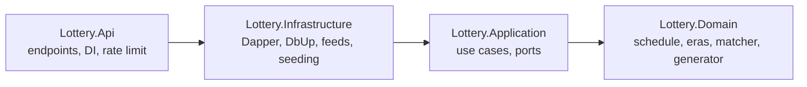

# LotteryApp

Powerball and Mega Millions results, next-draw countdowns, number generation, and
ticket checking against 24 years of real drawing history.

Not affiliated with MUSL, Powerball, or Mega Millions. Random picks are random -
past drawings do not predict future ones. Verify any win with the official lottery.

## Tech stack

| Layer | Technology |
|---|---|
| Backend | .NET 10 (LTS), C# 14, ASP.NET Core minimal APIs |
| Data access | Dapper (micro-ORM) - **no EF Core, no DbContext** ([why](#database-no-dbcontext)) |
| Migrations | DbUp, embedded per-provider SQL scripts |
| Database | SQLite (local dev) / Azure SQL serverless (production) |
| Time | .NET `TimeProvider` ([why](#timeprovider-vs-idatetimeprovider)) |
| Frontend | Angular (Phase 3, planned) |
| Hosting | Azure Static Web Apps + App Service (Phase 4, planned) |
| Packages | Central Package Management (`Directory.Packages.props`) + committed lock files |

## Architecture

Clean Architecture / onion - dependencies point inward only, enforced by project
references (an outward dependency is a compile error):



- **[Domain](src/Lottery.Domain/README.md)** - pure logic, zero dependencies: draw schedule, rule eras, ticket matching, prize tiers, pick generation.
- **[Application](src/Lottery.Application/README.md)** - use cases and the port interfaces (`IDrawRepository`, `IHistorySource`, ...) that Infrastructure implements.
- **[Infrastructure](src/Lottery.Infrastructure/README.md)** - Dapper repositories, connection factories, DbUp migrations, history seeding.
- **[Api](src/Lottery.Api/README.md)** - the composition root: minimal API endpoints, DI wiring, health checks, rate limiting.
- **[Tests](tests/README.md)** - 49 tests across all layers; [scripts](scripts/README.md) holds the PowerShell smoke test.

SOLID throughout: one reason to change per class (SRP), ports owned by the layer
that uses them (DIP), new adapters instead of edited use cases (OCP), and no
speculative abstractions. Notably **no MediatR** - [why below](#why-no-mediatr).

## How it works

1. **First boot**: DbUp migrates the database, then the one-time import seeds
   ~4,500 real drawings from committed JSON snapshots (no network needed). An
   `ImportLedger` row per game guarantees the import never runs twice.
2. **Ongoing** (Phase 2): a background service wakes after each drawing
   (Mon/Wed/Sat 10:59 PM ET for Powerball, Tue/Fri 11:00 PM ET for Mega Millions)
   and stores the new result. Until the feed publishes, the drawing is `Pending`.
3. **User requests** only ever read the local database - no user action triggers
   an external call.

```bash
dotnet run --project src/Lottery.Api
```

| Endpoint | Purpose |
|---|---|
| `GET /api/{game}/next-draw` | Next drawing instant (UTC) - countdown source |
| `GET /api/{game}/latest` | Latest drawing (`Published` or `Pending`) |
| `GET /api/{game}/draws?from=&to=&limit=` | History |
| `GET /api/{game}/check?whites=1,2,3,4,5&special=6` | Check a ticket against all history |
| `GET /api/{game}/rule-eras` | Number-matrix eras over time |
| `GET /api/{game}/generate` | Random era-valid picks |
| `GET /healthz` | Health (used by keep-alive + smoke test) |

`{game}` = `powerball` or `megamillions`. `/check` is GET on purpose: it reads
data and changes nothing, so it is cacheable and testable with a plain URL.

## Lottery number generation

`RandomPickGenerator` uses a **partial Fisher-Yates shuffle** of the full ball
pool, taking the first five - provably uniform, no duplicates possible, no
retry loop (a naive "random until unique" loop can spin; a plain array fill
produces duplicate numbers on one ticket). The special ball is drawn from its
own independent range - the two pools never mix.

Ranges come from the **rule-era table**, never from constants: Powerball is
5/69 + 1/26 today but was 5/59 + 1/35 before October 2015, and the generator
respects whatever era is current. Production uses `Random.Shared`
(thread-safe); tests inject a seeded `Random` for deterministic assertions.

## TimeProvider vs IDateTimeProvider

This codebase uses .NET's built-in `TimeProvider` abstraction rather than a
hand-rolled `IDateTimeProvider`. Both solve "code that calls
`DateTime.UtcNow` is untestable", but:

| Capability | Hand-rolled `IDateTimeProvider` | `TimeProvider` |
|---|---|---|
| Read the clock | yes | yes (`GetUtcNow()` returns `DateTimeOffset` - no `DateTimeKind` ambiguity) |
| Timers, `Task.Delay`, `PeriodicTimer` | no | yes - overloads accept a `TimeProvider` |
| Official test fake | write your own | `FakeTimeProvider` (`Microsoft.Extensions.TimeProvider.Testing`) |

The decisive rows are timers and delays: the Phase 2 background service sleeps
until 10:59 PM - with `FakeTimeProvider`, tests advance virtual time instantly
(`time.Advance(TimeSpan.FromHours(11))`) instead of actually waiting. The
Pending-status and DST-boundary tests in this repo work exactly that way. All
times are stored UTC; draw times are defined in Eastern Time and converted via
the `America/New_York` tz database, so DST transitions are handled by the
timezone data, not by hand-written offset math.

## Why no MediatR

Use cases are plain injected classes (`CheckTicket`, `GetLatestDraw`, ...).
MediatR is the reflexive add-on in Clean Architecture projects, but here it
would add indirection without benefit: there are seven use cases with one
consumer each, no cross-cutting pipeline behaviors that middleware doesn't
already cover, and direct constructor injection is easier to navigate and
debug. MediatR's move to commercial licensing settles any remaining doubt.
This is a recorded decision - please don't add it out of habit.

## Data: where numbers come from

- **Historical numbers** (in the repo now): committed JSON snapshots in
  `src/Lottery.Infrastructure/Seeding/Data/`, captured from the **NY Open Data**
  (Socrata) public datasets - Powerball `d6yy-54nr` (1,971 draws since 2010),
  Mega Millions `5xaw-6ayf` (2,522 draws since 2002). Committed snapshots make
  first boot offline and deterministic; the live Socrata feed will refresh and
  gap-repair in Phase 2.
- **Draw dates + jackpot amounts** (Phase 2): the official **powerball.com** and
  **megamillions.com** JSON endpoints. These are undocumented, so the schedule
  math acts as a fallback for dates and jackpot amounts hide gracefully if the
  endpoints change. No HTML scraping, ever - layout changes break scrapers.
- **Rule changes are data, not code**: `RuleEras` records every documented
  matrix change (7 Powerball eras back to 1992, 5 Mega Millions eras). Every
  imported draw is validated against its era; a test validates the entire
  history, so an undocumented rule change fails the build loudly instead of
  silently mis-validating tickets.

## Workflows

See [docs/workflows/README.md](docs/workflows/README.md). Current:
**CodeQL** (C# static analysis on push/PR + weekly) and **Dependabot** (weekly
NuGet + Actions update PRs). Planned in Phase 4: path-filtered deploys (API and
frontend deploy independently), a post-deploy smoke-test gate, a keep-alive
ping around draw times, and a weekly era-check run.

## Securing GitHub

Enabled on this repo before any code was pushed (and verifiable in Settings):

- **Secret scanning + push protection** - a pushed credential is blocked before
  it lands in history.
- **Dependabot alerts + automated security fixes** - vulnerable dependencies
  open PRs automatically.
- **CodeQL** static analysis - runs on every push/PR and weekly.
- **Zero-secrets design** - there are no secrets in this repo at all: local dev
  is SQLite (no credentials), production uses Azure Managed Identity (no SQL
  password exists) and Key Vault; deploys will use GitHub OIDC (no stored
  deploy credential). The only optional secret (a Socrata rate-limit token)
  lives in `dotnet user-secrets`, outside the repo tree.

## Files ignored and why

Highlights of [.gitignore](.gitignore) (commented inline):

| Rule | Why |
|---|---|
| `bin/`, `obj/`, `artifacts/`, `*.binlog` | Build output; binlogs can embed environment values |
| `TestResults/`, `coverage*` | Regenerated every test run |
| `*.db`, `*.db-*`, `*.sqlite*` | Local database **and** SQLite's shm/wal/journal side files - journal pages are a copy of your data |
| `appsettings.*.json` except `Development` | Environment configs tend to grow secrets; the committed dev file holds only the SQLite path and log levels |
| `.env*` except `.env.example` | Real env files never committed; the blank example documents shape |
| `*.pubxml`, `.azure/`, `*.bacpac`, `*.bak` | Publish profiles carry deploy creds; database exports are a full copy of your data |
| `http-client.private.env.json`, `.npmrc` | The two files where IDE/npm tokens land |
| `packages.lock.json` **not** ignored | Lock files are committed for reproducible restores |

## Database (no DbContext)

There is **no DbContext** - this project deliberately uses Dapper instead of
EF Core. The workload is read-heavy with a stable schema and no object graph;
hand-written SQL is faster to reason about and the ticket-check query is tuned
SQL. Consequences: repositories are named queries behind `IDrawRepository`,
migrations are plain SQL run by DbUp, and repository tests run against a real
SQLite database because with Dapper the SQL *is* the logic.

Schema (SQLite dialect; SQL Server version differs only in types/identity):

```sql
CREATE TABLE Draws (
    Id          INTEGER PRIMARY KEY AUTOINCREMENT,
    Game        TEXT NOT NULL,          -- 'Powerball' | 'MegaMillions'
    DrawDate    TEXT NOT NULL,          -- 'yyyy-MM-dd'
    White1..5   INTEGER NOT NULL,       -- stored sorted ascending
    Special     INTEGER NOT NULL,
    JackpotAmount NUMERIC NULL,         -- Phase 2
    JackpotWon  INTEGER NULL
);
CREATE UNIQUE INDEX UX_Draws_Game_DrawDate ON Draws (Game, DrawDate);

CREATE TABLE ImportLedger (             -- guards the one-time history import
    Game, Source, CompletedAtUtc, DrawCount, EarliestDraw, LatestDraw
);
```

Five sorted white-ball columns (not a serialized array) let the match query
run set-wise in pure SQL. The unique index makes every insert retry-safe.
Connections are **connectionless**: opened per operation, disposed
immediately, pooled by the driver; the SQL Server factory adds retry logic for
Azure SQL serverless auto-pause wake-ups. No backups are needed by design -
every byte is reconstructible from public sources (delete `lottery.db` and it
reseeds on next start).

## Smoke test (PowerShell)

[`scripts/smoke-test.ps1`](scripts/README.md) exercises **every endpoint,
including error conditions** - 22 checks: happy paths for both games plus
404 for unknown games and 400s for malformed tickets (too few numbers,
duplicates, out-of-era values, non-numeric input). It runs three ways: locally
against a dev server, in CI, and as the **post-deploy gate** - a failed smoke
test fails the deployment run.

```bash
pwsh scripts/smoke-test.ps1 -BaseUrl http://localhost:5000
```

## Testing

```bash
dotnet test
```

49 tests, all layers - including DST-boundary schedule tests driven by
`FakeTimeProvider` and an **era-coverage test** that validates all 4,493
historical draws against the rule-era table. Details in
[tests/README.md](tests/README.md).

## Lessons learned

Real bugs and problems hit while building, and their fixes:
[docs/LESSONS-LEARNED.md](docs/LESSONS-LEARNED.md).

## License

[MIT](LICENSE)
