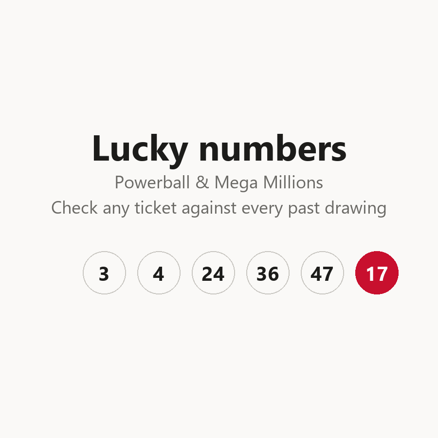
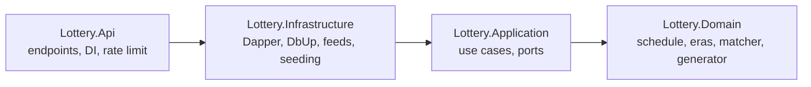

# LotteryApp

Powerball and Mega Millions results, next-draw countdowns, number generation, and
ticket checking against 24 years of real drawing history.

**Live app: <https://thankful-grass-06c113f10.7.azurestaticapps.net/>**

Not affiliated with MUSL, Powerball, or Mega Millions. Random picks are random -
past drawings do not predict future ones. Verify any win with the official lottery.

## Demo



Recorded against the **deployed** app: every jackpot, countdown and drawing above
is real data served by the live API. Ten tickets generated, then checked against
all 1,972 stored Powerball drawings.

## Tech stack

| Layer | Technology |
|---|---|
| Backend | .NET 10 (LTS), C# 14, ASP.NET Core minimal APIs |
| Data access | Dapper (micro-ORM) - **no EF Core, no DbContext** ([why](#database-no-dbcontext)) |
| Migrations | DbUp, embedded per-provider SQL scripts |
| Database | SQLite - dev **and** production, on App Service's persistent `/home`. Azure SQL is supported and config-switched, but deliberately not provisioned ([what actually runs](docs/ARCHITECTURE.md#what-is-actually-running-in-azure)) |
| Time | .NET `TimeProvider` ([why](#timeprovider-vs-idatetimeprovider)) |
| Frontend | Angular 22 in `lottery-web/`. Deploys independently of the API - path filters decide, not branches |
| Hosting | Azure Static Web Apps (frontend) + App Service (API) - **live**, $0/month |
| Packages | Central Package Management (`Directory.Packages.props`) + committed lock files |

## Architecture

Clean Architecture / onion - dependencies point inward only, enforced by project
references (an outward dependency is a compile error):



The full picture - the request path end to end, the middleware chain and why its
order matters, the background refresh, and what is actually provisioned in Azure
- is in **[docs/ARCHITECTURE.md](docs/ARCHITECTURE.md)**.

- **[Domain](src/Lottery.Domain/README.md)** - pure logic, zero dependencies: draw schedule, rule eras, ticket matching, prize tiers, pick generation.
- **[Application](src/Lottery.Application/README.md)** - use cases and the port interfaces (`IDrawRepository`, `IHistorySource`, ...) that Infrastructure implements.
- **[Infrastructure](src/Lottery.Infrastructure/README.md)** - Dapper repositories, connection factories, DbUp migrations, history seeding.
- **[Api](src/Lottery.Api/README.md)** - the composition root: minimal API endpoints, DI wiring, health checks, rate limiting.
- **[Tests](tests/README.md)** - 72 tests across all layers; [scripts](scripts/README.md) holds the PowerShell smoke test.

SOLID throughout: one reason to change per class (SRP), ports owned by the layer
that uses them (DIP), new adapters instead of edited use cases (OCP), and no
speculative abstractions. Notably **no MediatR** - [why below](#why-no-mediatr).

## How it works

1. **First boot**: DbUp migrates the database, then the one-time import seeds
   ~4,500 real drawings from committed JSON snapshots (no network needed). An
   `ImportLedger` row per game guarantees the import never runs twice.
2. **Ongoing**: a background service (`DrawRefreshService`) wakes shortly after
   each drawing (Mon/Wed/Sat 10:59 PM ET for Powerball, Tue/Fri 11:00 PM ET for
   Mega Millions), pulls new results from the live NY Open Data feed, and
   refreshes jackpot data - polling with backoff until the feed publishes.
   Until then the drawing is `Pending`. Startup runs a gap-repair pass, and
   `POST /internal/refresh` triggers the same cycle on demand (the keep-alive
   workflow's target), so downtime self-heals.
3. **User requests** only ever read the local database - no user action triggers
   an external call.

```bash
dotnet run --project src/Lottery.Api
```

| Endpoint | Purpose |
|---|---|
| `GET /api/{game}/next-draw` | Next drawing instant (UTC) - countdown source |
| `GET /api/{game}/latest` | Latest drawing (`Published` or `Pending`) |
| `GET /api/{game}/draws?from=&to=&limit=` | History |
| `GET /api/{game}/check?whites=1,2,3,4,5&special=6` | Check a ticket against all history |
| `GET /api/{game}/rule-eras` | Number-matrix eras over time |
| `GET /api/{game}/generate?count=N` | 1-10 random era-valid tickets (default 1) |
| `GET /healthz` | Health (used by keep-alive + smoke test) |
| `POST /internal/refresh` | Trigger a refresh cycle (optional `X-Refresh-Key` guard via env config) |

`{game}` = `powerball` or `megamillions`. `/check` is GET on purpose: it reads
data and changes nothing, so it is cacheable and testable with a plain URL.

### API documentation

| URL | What |
|---|---|
| `/` | Index of the API - games, endpoints, and the links below |
| `/scalar` | **Interactive API reference** (Development only) |
| `/openapi/v1.json` | The OpenAPI document itself (all environments) |

There is no Swagger UI, and that is not an omission: .NET 9 removed Swashbuckle
from the templates, and the built-in `AddOpenApi()` generates the *document*
with no interface. [Scalar](https://scalar.com) renders it instead - see
[lesson 22](docs/LESSONS-LEARNED.md).

## Operating the running system

Querying the production database (a SQLite **file** in the container, not a
managed service - so there is no connection string), reading logs, forcing a
data refresh, and rolling back: **[docs/OPERATIONS.md](docs/OPERATIONS.md)**.

```powershell
./scripts/query-db.ps1 "SELECT Game, COUNT(*) FROM Draws GROUP BY Game;"
```

## Lottery number generation

`RandomPickGenerator` uses a **partial Fisher-Yates shuffle** of the full ball
pool, taking the first five - provably uniform, no duplicates possible, no
retry loop (a naive "random until unique" loop can spin; a plain array fill
produces duplicate numbers on one ticket). The special ball is drawn from its
own independent range - the two pools never mix.

### Fisher-Yates, and why "partial"

The **[Fisher-Yates shuffle](https://en.wikipedia.org/wiki/Fisher%E2%80%93Yates_shuffle)**
is the standard algorithm for putting a list into a perfectly random order: walk
the array once, and at each position swap the current element with a randomly
chosen element from the not-yet-visited remainder. Every permutation comes out
exactly equally likely, in O(n) time - it is the algorithmic equivalent of
drawing numbered balls from a bag one at a time, where each pull removes the
ball from play.

The **partial** variant is the observation that a lottery ticket doesn't need
all 69 balls shuffled - only the first five draws matter. So the loop stops
after five iterations:

```csharp
var pool = Enumerable.Range(1, era.WhiteBallMax).ToArray();   // [1..69]
for (var i = 0; i < 5; i++)
{
    var j = _random.Next(i, pool.Length);   // pick from the undrawn remainder
    (pool[i], pool[j]) = (pool[j], pool[i]); // move it into the "drawn" prefix
}
// pool[0..4] is now a uniform 5-of-69 draw without replacement
```

After the loop, positions 0-4 hold five distinct, uniformly drawn numbers -
identical in distribution to a full shuffle's first five elements, at O(k)
cost instead of O(n). Because each drawn ball is swapped out of the remaining
pool, duplicates are *structurally impossible* - no "check and re-roll" loop
whose worst case is unbounded. The same page covers the classic
implementation mistakes the tests guard against (off-by-one ranges that make
the distribution subtly non-uniform - our full-range coverage test asserts
every ball 1..69 and 1..26 actually appears).

Ranges come from the **rule-era table**, never from constants: Powerball is
5/69 + 1/26 today but was 5/59 + 1/35 before October 2015, and the generator
respects whatever era is current. Production uses `Random.Shared`
(thread-safe); tests inject a seeded `Random` for deterministic assertions.
Non-cryptographic randomness is a reviewed, deliberate choice - these are
play suggestions, not stake-settling draws; the full analysis (including why
a CSPRNG would be mandatory if our RNG ever decided a real outcome) is in
[decision D21](docs/REQUIREMENTS-AND-DECISIONS.md#external-review-analyzed-why-not-a-csprng-d21).

## TimeProvider vs IDateTimeProvider

This codebase uses .NET's built-in `TimeProvider` abstraction rather than a
hand-rolled `IDateTimeProvider`. Both solve "code that calls
`DateTime.UtcNow` is untestable", but:

| Capability | Hand-rolled `IDateTimeProvider` | `TimeProvider` |
|---|---|---|
| Read the clock | yes | yes (`GetUtcNow()` returns `DateTimeOffset` - no `DateTimeKind` ambiguity) |
| Timers, `Task.Delay`, `PeriodicTimer` | no | yes - overloads accept a `TimeProvider` |
| Official test fake | write your own | `FakeTimeProvider` (`Microsoft.Extensions.TimeProvider.Testing`) |

The decisive rows are timers and delays: the Phase 2 background service sleeps
until 10:59 PM - with `FakeTimeProvider`, tests advance virtual time instantly
(`time.Advance(TimeSpan.FromHours(11))`) instead of actually waiting. The
Pending-status and DST-boundary tests in this repo work exactly that way. All
times are stored UTC; draw times are defined in Eastern Time and converted via
the `America/New_York` tz database, so DST transitions are handled by the
timezone data, not by hand-written offset math.

## Why no MediatR

Use cases are plain injected classes (`CheckTicket`, `GetLatestDraw`, ...).
MediatR is the reflexive add-on in Clean Architecture projects, but here it
would add indirection without benefit: there are seven use cases with one
consumer each, no cross-cutting pipeline behaviors that middleware doesn't
already cover, and direct constructor injection is easier to navigate and
debug. MediatR's move to commercial licensing settles any remaining doubt.
This is a recorded decision - please don't add it out of habit.

## Data: where numbers come from

Full deep-dive - exact endpoints, payload shapes, the Socrata token, quirks,
and failure modes: [docs/DATA-SOURCES.md](docs/DATA-SOURCES.md). Summary:

- **Historical numbers**: committed JSON snapshots in
  `src/Lottery.Infrastructure/Seeding/Data/`, captured from the **NY Open Data**
  (Socrata) public datasets - Powerball `d6yy-54nr` (1,971 draws since 2010),
  Mega Millions `5xaw-6ayf` (2,522 draws since 2002). Committed snapshots make
  first boot offline and deterministic.
- **New drawings**: the live Socrata feed (same datasets) via
  `SocrataWinningNumbersFeed` - incremental "everything after the latest stored
  draw", which doubles as gap-repair after downtime.
- **Jackpot amounts**: **megamillions.com**'s JSON service provides Mega
  Millions estimates, cash values, and rollover status; the **NY Lottery site
  API** (`nylottery.ny.gov/nyl-api`) provides Powerball's estimate and cash
  value (powerball.com retired its own public JSON API - it remains only as a
  fallback in the source chain). If every source fails, amounts go null and
  the UI hides them. Draw *dates* never depend on any feed: the schedule math
  computes them. No HTML scraping, ever - layout changes break scrapers.
- **Rule changes are data, not code**: `RuleEras` records every documented
  matrix change (7 Powerball eras back to 1992, 5 Mega Millions eras). Every
  imported draw is validated against its era; a test validates the entire
  history, so an undocumented rule change fails the build loudly instead of
  silently mis-validating tickets.

## Workflows

Full detail in [docs/workflows/README.md](docs/workflows/README.md). One
branch carries both halves, so there is one copy of each workflow. Path
filters keep the two deployments independent: a change under `lottery-web/**`
deploys the site and never the API, a change under `src/**` deploys the API
and never the site, and a docs-only change builds and deploys nothing.

**On `main`:** CI (build, tests, live smoke test), CodeQL (C#, built for full
dataflow), gitleaks, era check (weekly - catches a real-world lottery rule
change), keep-alive (draw-time pings, since F1 has no Always On), cleanup
(prunes old runs by count), and **Deploy API** - automatic on backend changes,
gated by the smoke test.

**On `frontend`:** CI, CI frontend (specs, build, OpenAPI client drift check),
CodeQL (JavaScript/TypeScript), gitleaks, and **Deploy frontend** - automatic
on `lottery-web/**` changes.

**Repo-wide:** Dependabot (weekly NuGet, npm and Actions updates across both
branches).

## Deploying to Azure

Free-tier provisioning is one command - `./scripts/provision-azure.ps1` -
which discovers your subscription, tenant, region and repository rather than
hardcoding them, creates F1 App Service + Free Static Web App + a $0 database,
and wires GitHub OIDC so deployment needs no stored credential. What the free
tier forces us to change (CORS instead of a linked backend; keep-alive instead
of Always On) is documented in
[docs/AZURE-DEPLOYMENT.md](docs/AZURE-DEPLOYMENT.md).

## Securing GitHub

Full detail, including the audit that produced this configuration and the
dependency-update policy: [docs/SECURITY-POSTURE.md](docs/SECURITY-POSTURE.md).
In short:

- **Secret scanning + push protection** - a pushed credential is blocked before
  it lands in history.
- **Dependabot alerts + security updates + weekly version updates** - NuGet,
  npm, and GitHub Actions, across **both** branches (the frontend entries
  declare `target-branch`, since Dependabot reads config only from `main`).
- **CodeQL** with the `security-extended` suite - C# on `main` built for full
  dataflow fidelity, JavaScript/TypeScript on `frontend`.
- **Branch protection** on both branches - PR required, CI required green,
  force-pushes and deletions blocked.
- **Private vulnerability reporting** enabled, matching what
  [SECURITY.md](SECURITY.md) promises.
- **gitleaks** on every push and PR, plus a weekly full-history sweep - covers
  the *generic* secrets GitHub's free provider-pattern scanning misses.
- **Zero-secrets design** - there are no secrets in this repo at all: local dev
  is SQLite (no credentials), production uses Azure Managed Identity (no SQL
  password exists); deploys use GitHub OIDC (no stored
  deploy credential). The only optional secret (a Socrata rate-limit token -
  [what it is and how to set it](docs/DATA-SOURCES.md#the-socrata-app-token-optional---and-the-app-runs-fine-without-one))
  lives in `dotnet user-secrets`, outside the repo tree. The refresh trigger's
  optional `Refresh:Key` follows the same rule: environment only, never a file.

## Files ignored and why

Highlights of [.gitignore](.gitignore) (commented inline):

| Rule | Why |
|---|---|
| `bin/`, `obj/`, `artifacts/`, `*.binlog` | Build output; binlogs can embed environment values |
| `TestResults/`, `coverage*` | Regenerated every test run |
| `*.db`, `*.db-*`, `*.sqlite*` | Local database **and** SQLite's shm/wal/journal side files - journal pages are a copy of your data |
| `appsettings.*.json` except `Development` | Environment configs tend to grow secrets; the committed dev file holds only the SQLite path and log levels |
| `.env*` except `.env.example` | Real env files never committed; the blank example documents shape |
| `*.pubxml`, `.azure/`, `*.bacpac`, `*.bak` | Publish profiles carry deploy creds; database exports are a full copy of your data |
| `http-client.private.env.json`, `.npmrc` | The two files where IDE/npm tokens land |
| `packages.lock.json` **not** ignored | Lock files are committed for reproducible restores |

## Database (no DbContext)

There is **no DbContext** - this project deliberately uses Dapper instead of
EF Core. The workload is read-heavy with a stable schema and no object graph;
hand-written SQL is faster to reason about and the ticket-check query is tuned
SQL. Consequences: repositories are named queries behind `IDrawRepository`,
migrations are plain SQL run by DbUp, and repository tests run against a real
SQLite database because with Dapper the SQL *is* the logic.

Schema (SQLite dialect; SQL Server version differs only in types/identity):

```sql
CREATE TABLE Draws (
    Id          INTEGER PRIMARY KEY AUTOINCREMENT,
    Game        TEXT NOT NULL,          -- 'Powerball' | 'MegaMillions'
    DrawDate    TEXT NOT NULL,          -- 'yyyy-MM-dd'
    White1..5   INTEGER NOT NULL,       -- stored sorted ascending
    Special     INTEGER NOT NULL,
    JackpotAmount NUMERIC NULL,         -- Phase 2
    JackpotWon  INTEGER NULL
);
CREATE UNIQUE INDEX UX_Draws_Game_DrawDate ON Draws (Game, DrawDate);

CREATE TABLE ImportLedger (             -- guards the one-time history import
    Game, Source, CompletedAtUtc, DrawCount, EarliestDraw, LatestDraw
);
```

Five sorted white-ball columns (not a serialized array) let the match query
run set-wise in pure SQL. The unique index makes every insert retry-safe.
Connections are **connectionless**: opened per operation, disposed
immediately, pooled by the driver; the SQL Server factory adds retry logic for
Azure SQL serverless auto-pause wake-ups. No backups are needed by design -
every byte is reconstructible from public sources (delete `lottery.db` and it
reseeds on next start).

## Smoke test (PowerShell)

[`scripts/smoke-test.ps1`](scripts/README.md) exercises **every endpoint,
including error conditions** - 32 checks: happy paths for both games,
security-header assertions, plus
404 for unknown games and 400s for malformed tickets (too few numbers,
duplicates, out-of-era values, non-numeric input). It runs three ways: locally
against a dev server, in CI, and as the **post-deploy gate** - a failed smoke
test fails the deployment run.

```bash
pwsh scripts/smoke-test.ps1 -BaseUrl http://localhost:5000
```

## Testing

```bash
dotnet test
```

72 tests, all layers - including DST-boundary schedule tests driven by
`FakeTimeProvider`, an **era-coverage test** that validates all 4,493
historical draws against the rule-era table, and feed contract tests against
recorded real payloads. Details in [tests/README.md](tests/README.md).

## Requirements and design decisions

The full requirements list, the decision log (with rejected alternatives), and
the approved design: [docs/REQUIREMENTS-AND-DECISIONS.md](docs/REQUIREMENTS-AND-DECISIONS.md).

## Lessons learned

Every defect and near-miss hit while building this - what caught it, why it
happened, the fix, and the takeaway, plus a summary of which detector caught
what: [docs/LESSONS-LEARNED.md](docs/LESSONS-LEARNED.md).

## Security

Vulnerability reporting: [SECURITY.md](SECURITY.md).

## License

[MIT](LICENSE)
