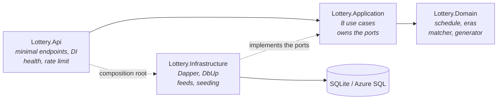
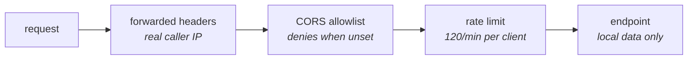
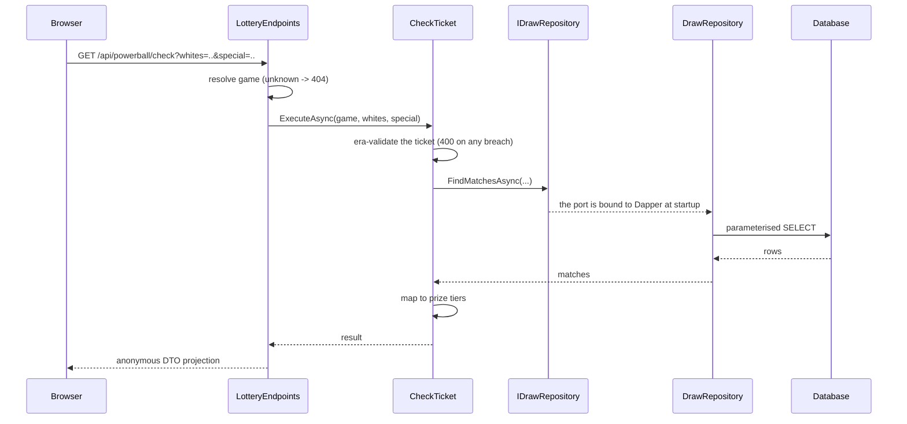
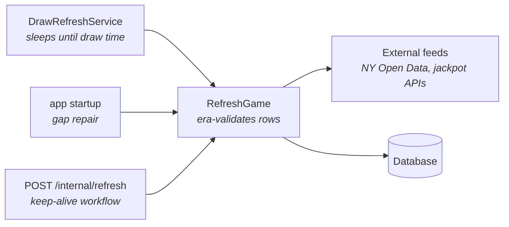

# API architecture - how a request actually flows

The shape of the backend, the path a request takes through it, and what is
really running in Azure. Back to the [main README](../README.md); the frontend's
equivalent lives on the `frontend` branch at `lottery-web/ARCHITECTURE.md`.

## Layers, and the rule that holds them apart



**Dependencies point inward only, and the compiler enforces it.**
`Lottery.Domain` has no project references at all, so a use case *cannot* reach
a Dapper type - there is no reference to reach it through. An outward dependency
is a build error, not a code-review note.

`Lottery.Api` referencing `Lottery.Infrastructure` is the one arrow that looks
backwards and isn't: it exists solely so the composition root can bind
implementations to ports at startup. No endpoint calls an Infrastructure type.

| Project | Contains | References |
|---|---|---|
| `Lottery.Domain` | Draw schedule, rule eras, ticket matcher, prize tiers, pick generator | none |
| `Lottery.Application` | Use cases + the port interfaces (`IDrawRepository`, `IHistorySource`, `IJackpotStore`, ...) | Domain |
| `Lottery.Infrastructure` | Dapper repositories, connection factories, DbUp migrations, feed clients, snapshot seeding | Application, Domain |
| `Lottery.Api` | Minimal API endpoints, DI wiring, health check, rate limiter, CORS | all of the above |

## What every request passes through



Order matters. `UseForwardedHeaders` runs **first** because the rate limiter
partitions on `Connection.RemoteIpAddress`; behind App Service that address is
the platform front end, so without this every caller in the world shares one
partition - see [F9 in the security posture](SECURITY-POSTURE.md).

## A request, end to end



Two things that projection buys: Domain types never serialize directly, so
renaming a domain property cannot silently break the API contract; and the
response shape is visible in one place rather than inferred from a class.

## Endpoints

| Endpoint | Use case | Notes |
|---|---|---|
| `GET /api/{game}/next-draw` | `GetNextDraw` | Schedule math + stored jackpot estimate |
| `GET /api/{game}/latest` | `GetLatestDraw` | `Published` or `Pending` |
| `GET /api/{game}/draws?from=&to=&limit=` | `GetDraws` | `limit` clamped to 1-200 |
| `GET /api/{game}/check?whites=&special=` | `CheckTicket` | GET on purpose - reads nothing, changes nothing |
| `GET /api/{game}/rule-eras` | `GetRuleEras` | The number matrix over time |
| `GET /api/{game}/generate?count=N` | `GeneratePicks` | 1-10 era-valid tickets |
| `GET /healthz` | `DatabaseHealthCheck` | Counts rows - proves connectivity, schema and seed |
| `POST /internal/refresh` | `RefreshGame` x2 | Key-guarded via `X-Refresh-Key` |
| `GET /` | - | API index rather than a 404 |

`{game}` is `powerball` or `megamillions`; anything else returns 404 with a hint.

## No user request ever calls out



Three triggers, one cycle. Endpoints read only the local database, so a feed
that is down, lagging, or has changed shape cannot slow or break a visitor's
request - the worst case is a jackpot figure going stale, and the UI hides a
missing amount rather than erroring. Endpoint detail, payload shapes and quirks
are in [DATA-SOURCES.md](DATA-SOURCES.md).

## What is actually running in Azure

SQLite was **not** migrated to a managed database. Nothing was provisioned:

| Resource | Type |
|---|---|
| `asp-lottery` | App Service plan (F1, free) |
| `app-lottery-...` | Web app - the API |
| `swa-lottery-...` | Static Web App - the frontend |

`az sql server list` returns nothing. The live app runs:

```
Database__Provider          = Sqlite
ConnectionStrings__Default  = Data Source=/home/data/lottery.db
```

`/home` on App Service is persistent, network-mounted storage that survives
restarts and redeploys, so the database file is not ephemeral. First boot runs
DbUp, then the one-time import seeds 4,493 drawings from the committed JSON
snapshots - offline, no network required - and the `ImportLedger` guarantees it
never repeats.

**Why not Azure SQL.** The design supports it: `Database:Provider` switches
connection factories and per-provider DbUp scripts already exist ([D3](REQUIREMENTS-AND-DECISIONS.md)).
Provisioning one simply breaks the $0/month goal, since no Azure SQL tier fits
free. Switching is one app setting plus a connection string, whenever the data
outgrows a single file.

**What that directory once cost.** SQLite creates *files* but never
*directories*, and `/home/data` did not exist. Every start failed, App Service
restarted the app, and 51 restarts burned a day's CPU quota before the cause was
found. `SqliteConnectionFactory` now ensures the directory exists, and startup
failures log and serve 503s instead of exiting - the full account is
[lesson 25](LESSONS-LEARNED.md).
