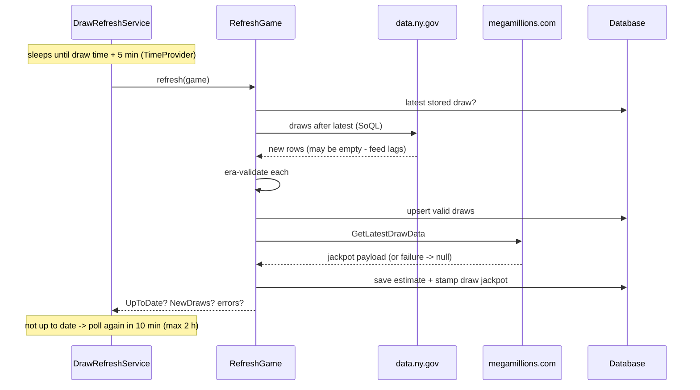

# Data sources - the ins and outs

Everything external this app talks to: exact endpoints, payload shapes, quirks,
failure modes, and the token story. Back to the [main README](../README.md).

## Overview

| Data | Source | Endpoint | Status |
|---|---|---|---|
| Historical winning numbers | NY Open Data (Socrata) | `data.ny.gov/resource/{dataset}.json` | Working; also captured as committed snapshots |
| New drawings (ongoing) | Same Socrata datasets | Same, filtered by date | Working |
| Mega Millions jackpots | megamillions.com utility service | `GetLatestDrawData` | Working |
| Powerball jackpots | **NY Lottery site API** | `nylottery.ny.gov/nyl-api/games/powerball/draws` | Working (primary) |
| Powerball jackpots (fallback) | powerball.com API | `/api/v1/estimates/powerball` | **Retired by MUSL** - kept as best-effort fallback |
| Next draw dates | *No feed at all* | Computed by `DrawSchedule` | Always works |

Two rules govern every source: **no HTML scraping, ever** (layout changes break
scrapers), and **feed failures degrade, never crash** - the app always serves
whatever it has.

## NY Open Data (Socrata) - winning numbers

The New York State open-data portal republishes every Powerball and Mega
Millions drawing as machine-readable datasets. This is the only free, stable,
full-history source that isn't scraping.

| Game | Dataset ID | URL | Coverage |
|---|---|---|---|
| Powerball | `d6yy-54nr` | `https://data.ny.gov/resource/d6yy-54nr.json` | Feb 2010 -> present |
| Mega Millions | `5xaw-6ayf` | `https://data.ny.gov/resource/5xaw-6ayf.json` | May 2002 -> present |

**Row shape** - Powerball packs all six numbers into one space-separated string
(last = the red Powerball); Mega Millions keeps the Mega Ball in its own field:

```json
// Powerball
{ "draw_date": "2026-07-25T00:00:00.000", "winning_numbers": "03 04 24 36 47 17", "multiplier": "4" }
// Mega Millions
{ "draw_date": "2026-07-24T00:00:00.000", "winning_numbers": "02 05 42 44 60", "mega_ball": "1", "multiplier": "-1" }
```

**How the history was pulled (once)**: one paged request per game with
`$limit=5000&$order=draw_date` fetched the entire history (1,971 + 2,522 rows),
which was transformed to compact JSON and **committed** as
`src/Lottery.Infrastructure/Seeding/Data/*.json` (embedded resources). First
boot seeds from these snapshots - offline, deterministic, era-validated, and
guarded by the `ImportLedger` so it never runs twice.

**How new draws are pulled (ongoing)**: `SocrataWinningNumbersFeed` issues a
SoQL-filtered query for everything after the latest stored draw:

```
GET /resource/d6yy-54nr.json?$where=draw_date > '2026-07-25T23:59:59'&$order=draw_date&$limit=200
```

Because the query is "everything after X", the same call is also **gap-repair**:
if the app was down for two weeks, the next refresh pulls the whole missed range.

**Quirks to know**: the feed lags the actual drawing (minutes to hours - which
is why draws show as `Pending` and the refresh service polls with backoff);
dates are midnight-stamped timestamps (only the date part matters); numbers are
zero-padded strings; and the Mega Millions `multiplier` of `-1` means
"not applicable", not data corruption.

## The Socrata app token (optional - and the app runs fine without one)

Socrata rate-limits anonymously by IP from a shared pool. An **app token**
identifies your application and grants a much larger allowance (~1,000
requests/rolling hour). It is **not authentication** - the data is public -
and this app's traffic (a few requests per week after the one-time snapshot)
sits far below anonymous limits, so the token is genuinely optional.

### Where to get one

Create a free account at [data.ny.gov](https://data.ny.gov), then **profile ->
Developer settings -> Create new app token**. The portal generates the value;
it is never chosen or derived by this project, and no token value appears
anywhere in this repository or its documentation.

### Where it is stored

The code asks configuration for a single key - `Feeds:SocrataAppToken` - and
never knows which source answered. Each environment supplies it differently,
and **none of them is a file in this repository**:

| Environment | Physical location | How it gets there |
|---|---|---|
| Local development | `%APPDATA%\Microsoft\UserSecrets\<UserSecretsId>\secrets.json` - your machine, outside the repo | `dotnet user-secrets set "Feeds:SocrataAppToken" "<paste-token>" --project src/Lottery.Api` |
| Azure (default) | App Service **application setting** `Feeds__SocrataAppToken` - Portal: App Service -> Settings -> Environment variables | `./scripts/provision-azure.ps1 -SocrataToken (Read-Host -AsSecureString)` |
| Azure (`-WithKeyVault`) | **Key Vault** secret `Feeds--SocrataAppToken`; the app setting holds only an `@Microsoft.KeyVault(...)` reference | `./scripts/provision-azure.ps1 -SocrataToken $t -WithKeyVault` |

The two Azure rows are **alternatives chosen at provisioning time, not a
fallback chain** - there is no failover between them. Supply no token and
neither is created; the feed simply runs anonymously. Which one to pick, and
the separation-of-duties difference that decides it, is in
[Azure deployment](AZURE-DEPLOYMENT.md#the-difference-that-actually-matters).

Two mechanics worth knowing:

- **Double underscore.** Environment variables cannot contain a colon, so
  .NET maps `Feeds__SocrataAppToken` (the App Service setting) to
  `Feeds:SocrataAppToken` (the config key). Same convention as
  `Database__Provider` and `ConnectionStrings__Default`.
- **Key Vault references.** With `-WithKeyVault` the app setting's *value* is
  `@Microsoft.KeyVault(SecretUri=...)`. App Service resolves it at startup
  using the app's managed identity, so the token never appears in
  configuration and gains rotation and audit logging. The application code is
  identical either way.

The provisioning script takes the token as a **SecureString**, converts it at
the last possible moment, clears it from memory immediately, and never writes
or prints it. Nothing about the value reaches disk or the console.

Treat the token as a secret even though it protects nothing: it is tied to
your account, and a published one lets strangers burn your rate allowance.
`SocrataWinningNumbersFeed` adds the `X-App-Token` header only when the config
value is present, which is why every environment above is free to omit it.

## megamillions.com - jackpots (fully working)

```
GET https://www.megamillions.com/cmspages/utilservice.asmx/GetLatestDrawData
```

An ASMX-era service returning **JSON wrapped in XML** - the body is
`<string xmlns="...">{ ...json... }</string>`, so the adapter parses the XML
envelope first, then the JSON inside. The payload carries more than we use:

```json
{
  "Drawing": { "PlayDate": "2026-07-24T00:00:00", "N1": 2, "N2": 5, "N3": 42, "N4": 44, "N5": 60, "MBall": 1 },
  "Jackpot": {
    "PlayDate": "2026-07-24T00:00:00",
    "CurrentPrizePool": 743000000.0,   // the LAST drawing's jackpot
    "NextPrizePool": 800000000.0,      // the upcoming estimated jackpot
    "CurrentCashValue": 323400000.0,
    "NextCashValue": 344200000.0,
    "Winners": 0                        // jackpot winners last drawing
  }
}
```

Mappings worth spelling out:

- `NextPrizePool` / `NextCashValue` -> the estimate shown with the countdown
  (persisted per game in the `JackpotEstimates` table by each refresh).
- `CurrentPrizePool` -> stamped onto the stored draw's `JackpotAmount`.
- **`Winners: 0` -> `JackpotWon = false` -> "rolled over"** - rollover
  detection is just "did anyone hit all six", straight from the winner count.
- Amounts are raw decimals (no "$800 Million" string parsing needed here).

This endpoint is **undocumented** - it's what the site's own widgets call - so
the adapter parses defensively and any shape change degrades to null rather
than throwing. A contract test pins the recorded real payload so a silent
change breaks CI, not production.

## NY Lottery site API - Powerball jackpots (primary)

```
GET https://nylottery.ny.gov/nyl-api/games/powerball/draws
```

The API behind nylottery.ny.gov's own game pages - government-run, structured
JSON, no bot protection. The upcoming-draw entry carries exactly what the
Powerball card needs, and the figures match powerball.com's display:

```json
{ "data": { "draws": [
  { "drawTime": 1785124800000, "estimatedJackpot": 633000000,
    "jackpots": [{ "amount": 633000000, "cashAmount": 277300000 }],
    "gameName": "powerball", "drawNumber": 1978 },
  { "drawTime": 1784952000000, "drawNumber": 1977,
    "results": [{ "primary": ["3","4","24","36","47"], "secondary": ["17"] }] }
]}}
```

- `estimatedJackpot` / `jackpots[0].cashAmount` -> the card's estimate + cash
  value (persisted to `JackpotEstimates` by the refresh cycle).
- The payload also carries past results - unused (winning numbers come from
  the Socrata datasets), but a useful cross-check.
- Undocumented like the other site APIs, so: defensive parsing, null on any
  shape change, contract test pinning the recorded payload.
- Last-draw jackpot amount / rollover status are not in this payload, so the
  Powerball card omits the "rolled over" line (Mega Millions keeps it - its
  feed is richer).

## powerball.com - jackpots (retired; now the fallback)

The design named `https://www.powerball.com/api/v1/estimates/powerball?_format=json`
as the Powerball jackpot source. During Phase 2 build-out, probing revealed
MUSL has **retired the public API**: the route now returns the SPA homepage,
the page is server-rendered (no XHR data call to adopt instead), and the site
sits behind bot protection that blanks non-browser clients.

The NY Lottery API above now fills the gap as the primary source; this
adapter remains in the chain as a just-in-case fallback (first-success wins in
`CompositeJackpotFeed`), and the graceful-degradation path still applies if
*both* sources fail:

- **Draw dates and countdowns are never affected** - they come from
  `DrawSchedule` math, not from any feed.
- With both sources down, Powerball jackpot amounts go `null` and the UI
  hides them; numbers, checking, and generation stay fully functional.
- `PowerballJackpotFeed` treats anything that isn't clean JSON as
  "unavailable" and still knows the old payload shape (`"$633 Million"` money
  strings included) should MUSL restore it. Contract tests cover the
  HTML-degradation path, the historical JSON shape, and the NY payload.

Full story: [lessons learned #8](LESSONS-LEARNED.md#8-the-undocumented-endpoint-risk-materialized---before-a-line-of-feed-code-was-written-phase-2).

## How it all flows



The same `RefreshGame` cycle runs from three triggers: the scheduled wake, app
startup (gap-repair), and `POST /internal/refresh` (keep-alive workflow /
manual). Every failure mode - feed down, feed lagging, bot-blocked, shape
change - lands in the same place: the result reports it, the app serves what
it has, and the next cycle tries again.

## Trust and resilience posture

- All feed clients are typed `HttpClient`s with the **standard resilience
  pipeline** (retry, circuit breaker, timeout).
- Live feed rows are **era-validated before storage**; invalid rows are
  skipped and counted, never stored.
- No user request ever triggers an external call - feeds run only in the
  refresh cycle. External sources can be slow or dead without a visitor ever
  noticing beyond a missing dollar figure.
