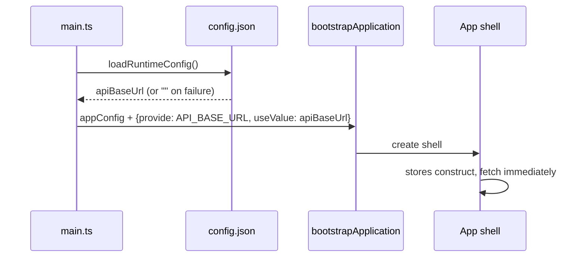
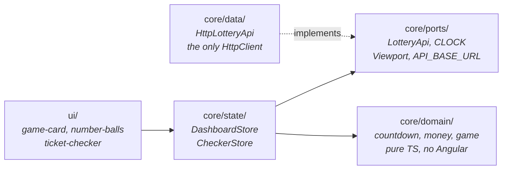
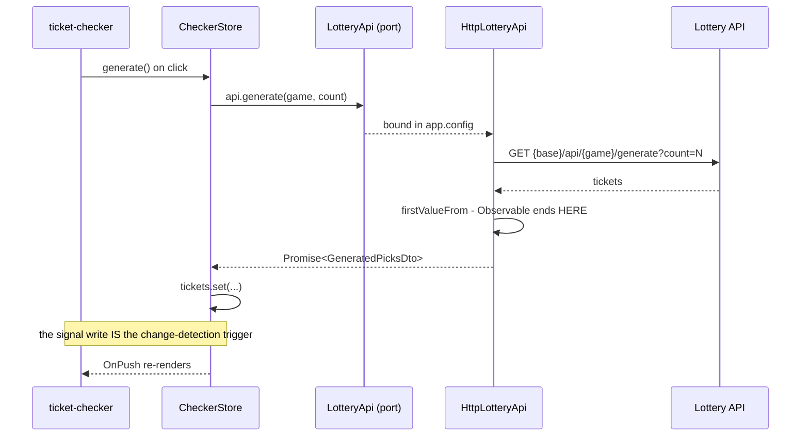
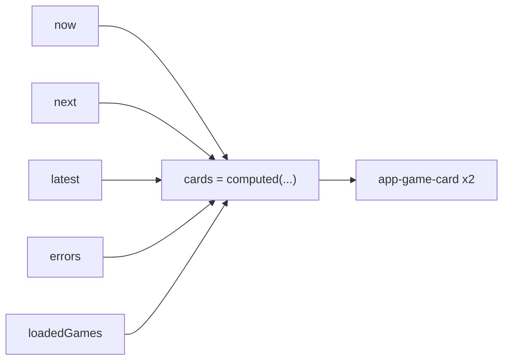

# Frontend architecture - how a click reaches the API

The shape of the Angular app, what happens before it renders, and the path one
interaction takes. Back to the [frontend README](README.md); the API's
equivalent lives on `main` at `docs/ARCHITECTURE.md`.

## Startup - resolved before anything renders



The API origin is resolved **before** bootstrap deliberately, so it is a plain
injectable string rather than a promise every adapter has to await. Empty
locally, where the dev proxy makes `/api` same-origin; the App Service URL in
Azure, because the free Static Web Apps SKU has no linked-backend proxy.

A missing or unreadable `config.json` is not an error - it resolves to `""`,
which is exactly right for local dev and any single-host deployment.

`app.config.ts` is the composition root and the only place a concrete class is
named:

```ts
provideZonelessChangeDetection()
provideHttpClient()
{ provide: LotteryApi, useClass: HttpLotteryApi }   // the DIP binding
```

## Layers, and the rule that holds them apart



Nothing points outward. `ui` never sees HTTP, stores never see `HttpClient`, and
`core/domain` never imports Angular at all - which is why its tests need no
TestBed.

| Folder | Holds | Knows about |
|---|---|---|
| `core/domain` | `countdown.ts`, `money.ts`, `game.ts` | nothing - plain functions |
| `core/ports` | `LotteryApi` (abstract class), `CLOCK`, `Viewport`, `API_BASE_URL` | domain types only |
| `core/data` | `HttpLotteryApi` | ports + `HttpClient` |
| `core/api` | `schema.d.ts` - **generated** from the backend's OpenAPI | nothing |
| `core/state` | `DashboardStore`, `CheckerStore` | ports + domain |
| `ui` | `game-card`, `number-balls`, `ticket-checker` | inputs; the checker injects its store |
| `app.ts` | the only smart shell | both stores + `Viewport` |

## One interaction, end to end



The Observable exists for the duration of one function call and never escapes
the adapter. That is why `LotteryApi` declares `Promise<T>`, not `Observable<T>`
- a port that spoke Observables would push RxJS and subscription lifecycles onto
every consumer, and would make `FakeLotteryApi` far more than the handful of
`Promise.resolve(...)` lines it is.

## Signals, not RxJS

| Concern | What is used |
|---|---|
| All app state | Signals (`signal`, `computed`, `effect`) |
| Change detection | Zoneless - a signal write is the trigger |
| Async API calls | Promises (`async`/`await`) |
| RxJS | One import, one call: `firstValueFrom` in the adapter |

The board is *synchronous derived data*, not an event stream. `DashboardStore`
holds five source signals and exposes one `computed`:



A `setInterval` writes `now` once a second; that single write makes `cards`
stale and both countdowns re-render. No subscriptions, no `async` pipe, no
teardown. Modelling this as a stream would be ceremony without payoff.

**Self-healing:** when a draw time passes, `load()` schedules a refetch 30
seconds later, so a card flips to `Pending` and then to the new numbers on its
own.

Where RxJS *would* earn its place - debounced type-ahead, websockets,
retry-with-backoff, racing overlapping requests - none of it exists here.

## The shell and the two layouts

`App` injects both stores plus `Viewport`, and owns the mobile tab state. Two
effects do the coordination:

- results arriving switch a phone to the **Wins** tab, so the answer is not
  rendered on a screen nobody is looking at
- widening past 640px resets to the single-page layout

`TicketChecker` takes a `section` input (`all` | `entry` | `results`) defaulting
to `all`, so one component serves the desktop page and two phone tabs. Details
in the [README](README.md#responsive-layout-d23).

## Why the ports pay for themselves

Every spec swaps a real dependency for a fake - there is no HTTP mocking
anywhere in the suite:

| Port | Real | In tests |
|---|---|---|
| `LotteryApi` | `HttpLotteryApi` | `FakeLotteryApi` |
| `CLOCK` | `() => Date.now()` | a frozen number |
| `Viewport` | `matchMedia` listener | `FakeViewport` |

That is how 45 specs run in well under a second, and how both layouts get
pinned without resizing a real browser window.
